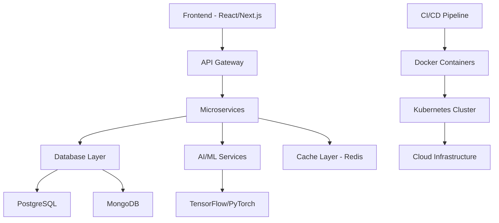

<div align="center">
  
</div>

<div align="center">
  
</div>

<div align="center">
  
</div>

##  System Architecture

```typescript
interface Developer {
  name: string;
  role: string[];
  languages: string[];
  frameworks: string[];
  databases: string[];
  cloud: string[];
  ai_ml: string[];
  currentlyLearning: string[];
  architecture: string[];
}

const ashwinPandey: Developer = {
  name: "Ashwin Pandey",
  role: ["Full Stack Developer", "AI Engineer", "Cloud Architect", "DevOps Engineer"],
  
  languages: ["Python", "JavaScript", "TypeScript", "Java", "C++", "Go", "Rust"],
  
  frameworks: {
    frontend: ["React", "Next.js", "Vue.js", "Angular", "Svelte"],
    backend: ["Node.js", "Django", "FastAPI", "Spring Boot", "Express"],
    mobile: ["React Native", "Flutter", "Ionic"],
    desktop: ["Electron", "Tauri"]
  },
  
  databases: ["PostgreSQL", "MongoDB", "Redis", "Neo4j", "Cassandra", "InfluxDB"],
  
  cloud: ["AWS", "GCP", "Azure", "Docker", "Kubernetes", "Terraform"],
  
  ai_ml: ["TensorFlow", "PyTorch", "OpenAI", "Hugging Face", "LangChain", "MLflow"],
  
  currentlyLearning: ["WebAssembly", "Quantum Computing", "Edge AI"],
  
  architecture: ["Microservices", "Serverless", "Event-Driven", "CQRS", "DDD"]
};

console.log("🚀 Ready to build amazing things!");
```

##  Tech Arsenal

<div align="center">

### 🔥 Core Technologies


### ⚡ Frontend Mastery


### 🚀 Backend Excellence


### 🤖 AI & Machine Learning

<br/>


### ☁️ Cloud & DevOps


### 🗄️ Databases


### 🛠️ Tools & Platforms


</div>

##  Performance Metrics

<div align="center">
  
  
</div>

<div align="center">
  
</div>

##  Current Sprint

```python
class ProjectManager:
    def __init__(self):
        self.active_projects = {
            "ai_saas_platform": {
                "stack": ["Next.js", "FastAPI", "PostgreSQL", "OpenAI", "Stripe"],
                "progress": 85,
                "status": "🚀 Production Ready",
                "features": ["AI Chat", "Payment Integration", "Analytics Dashboard"]
            },
            "microservices_architecture": {
                "stack": ["Docker", "Kubernetes", "gRPC", "Redis", "Prometheus"],
                "progress": 70,
                "status": "🔧 In Development",
                "features": ["Service Mesh", "Auto Scaling", "Monitoring"]
            },
            "ml_ops_pipeline": {
                "stack": ["MLflow", "Kubeflow", "TensorFlow", "Apache Airflow"],
                "progress": 60,
                "status": "🧪 Testing Phase",
                "features": ["Model Versioning", "A/B Testing", "Auto Deployment"]
            }
        }
    
    def deploy_to_production(self):
        return "Shipping features that matter 🚀"

# Initialize project manager
pm = ProjectManager()
print(pm.deploy_to_production())
```

##  System Architecture

<div align="center">



</div>

##  Achievement Unlocked

<div align="center">
  
</div>

##  Contribution Heatmap

<div align="center">
  
</div>

##  Connect & Collaborate

<div align="center">

[](https://linkedin.com/in/ashwin-pandey)
[](https://twitter.com/ashwin_pandey)
[](https://ashwinpandey.dev)
[](mailto:ashwin@example.com)

</div>

---

<div align="center">
  
</div>

<div align="center">
  
[](https://github.com/Pandeyashwin26)
[](https://github.com/Pandeyashwin26)
[](https://github.com/Pandeyashwin26)

**"Code is poetry written in logic"** ✨

</div>